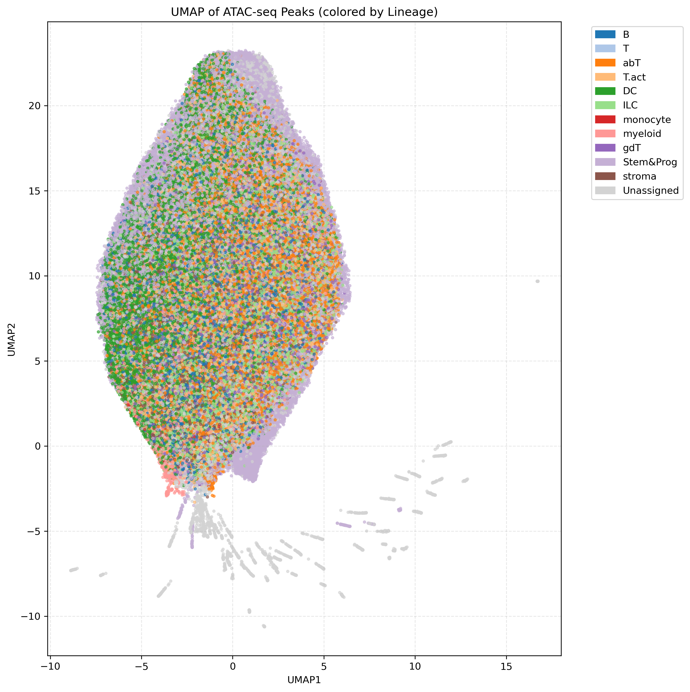
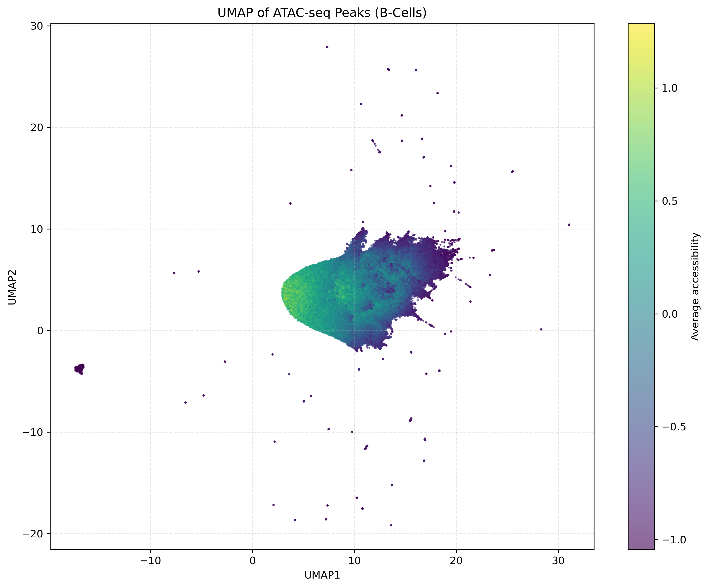
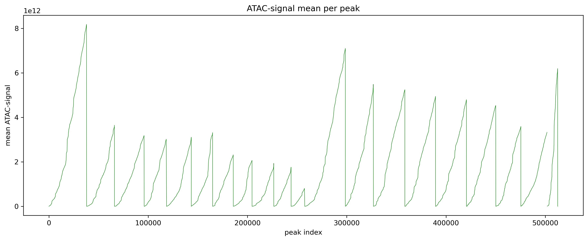
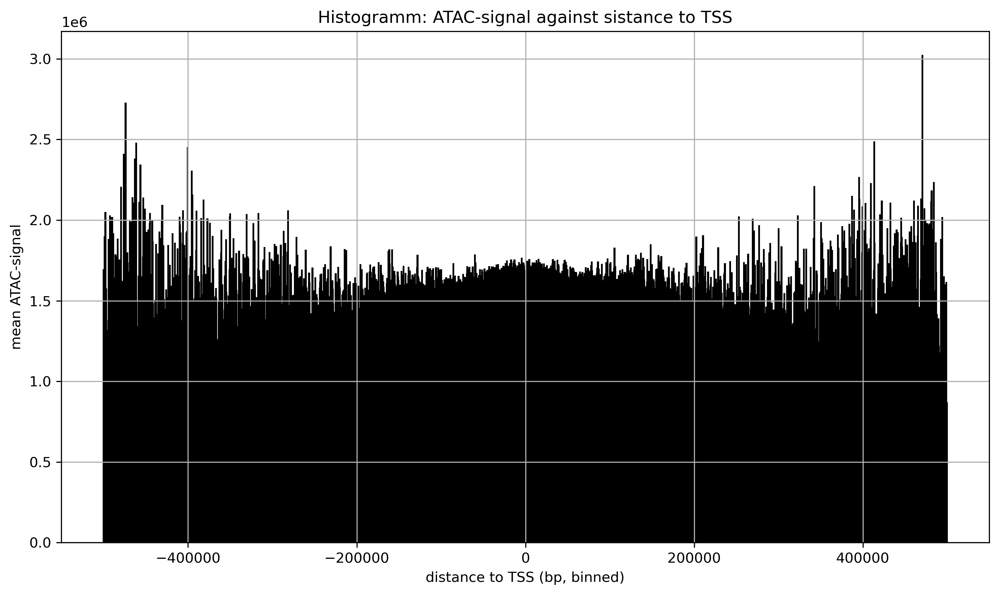
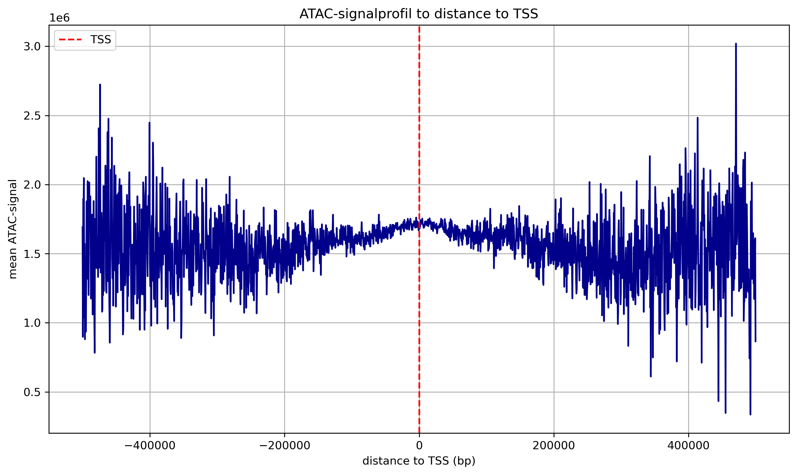
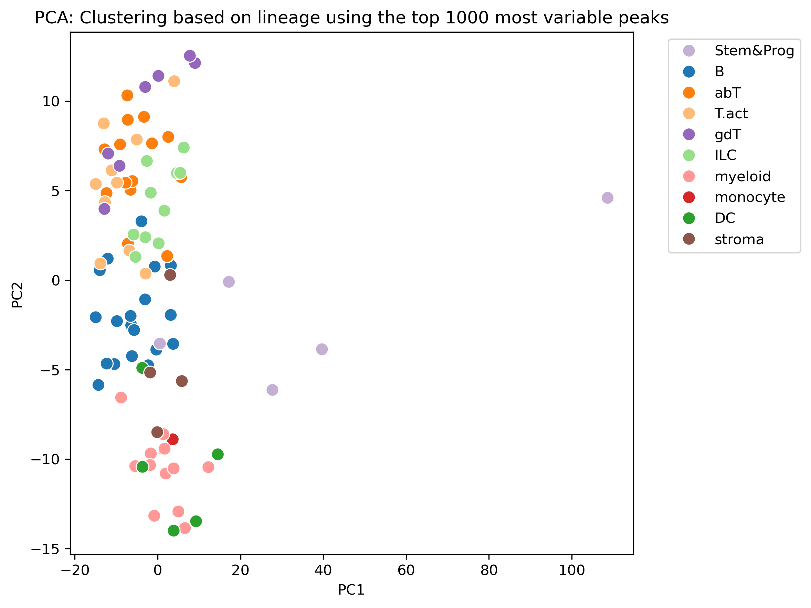
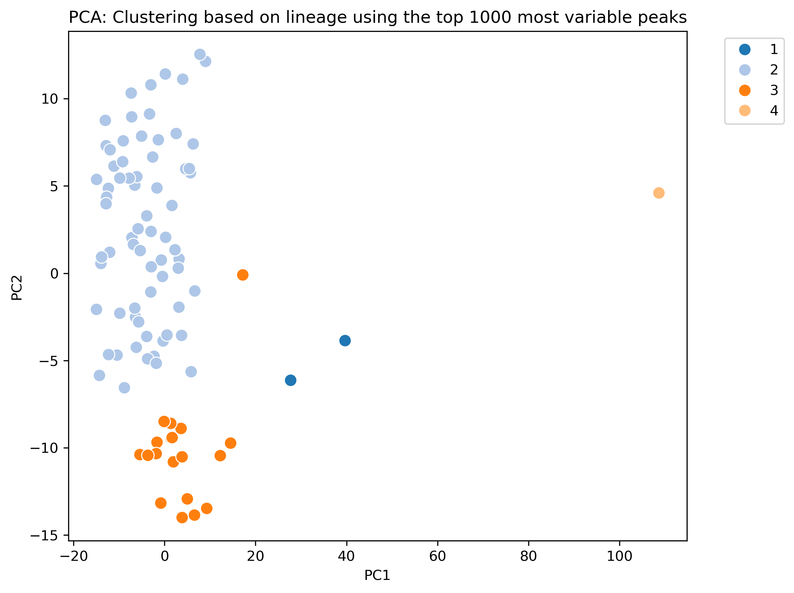
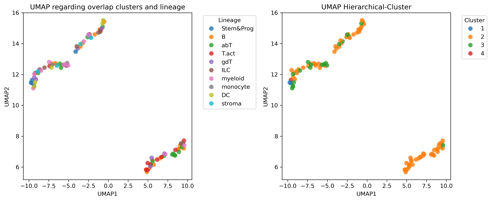
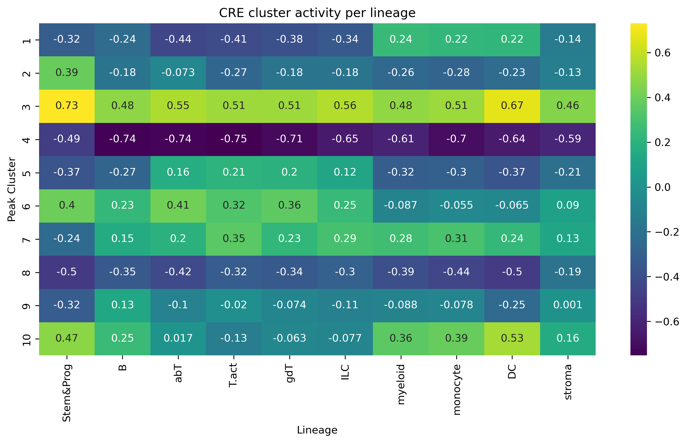
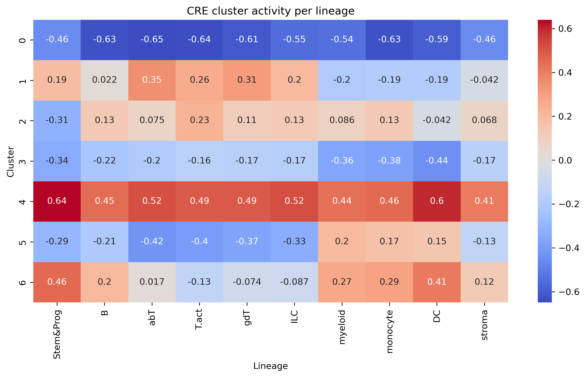

# B-cells-Team1

Heibox with tables converted to csv-format: 

https://heibox.uni-heidelberg.de/d/8eb927e475024eb3ae66/

To implement the collective virtual environment: 

cd *project directory*\
conda env create -f environment.yml\
conda activate envBCells1

## 1. i

### a. ATAC QC vs stats

### mean ATAC peaks colored by lineage

-> remove first cell ??

### UMAP of ATAC peaks colored by lineage

## 1. ii

### a. remove peaks due to low signal 

### b. Signals of promotors and enhancers

### Distribution of mean ATAC peaks

### OCR landscape - UMAP

## 1. iii

### PCA

### UMAP to determine the overlap between the clusters and the true lineage

### Correlation of Peak-Clusters and lineages

## 1. iv

### Cre cluster activity per lineage

-> CRE specific data or the same as plot before

### Tried to cluster CREs based on Gini-index 

### CRE-Cluster across lineages

->does not make sense since i used Gini-index

## 2. i

### RNA vs ATAC

## 2. ii
### Mean gene expression per cluster across lineages 

### Distribution of gene expression in gene clusters across lineages

### Mean gene expression per cluster across lineages

### Distribution of gene expression in gene subclusters across lineages

