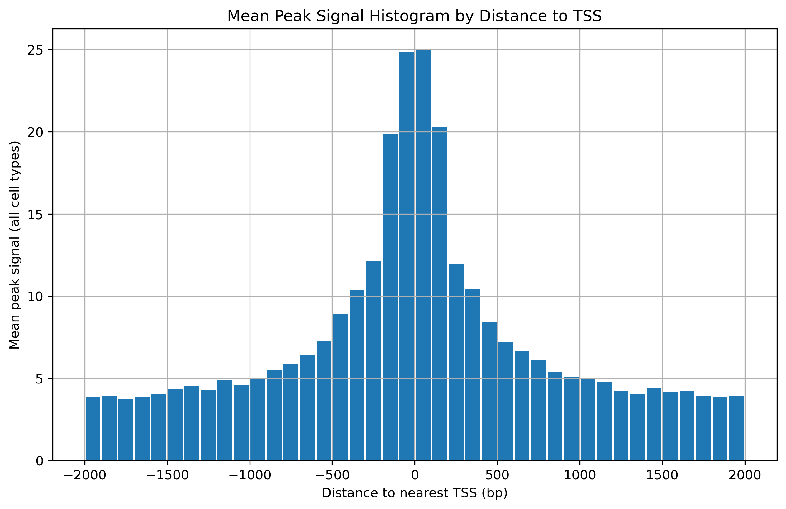
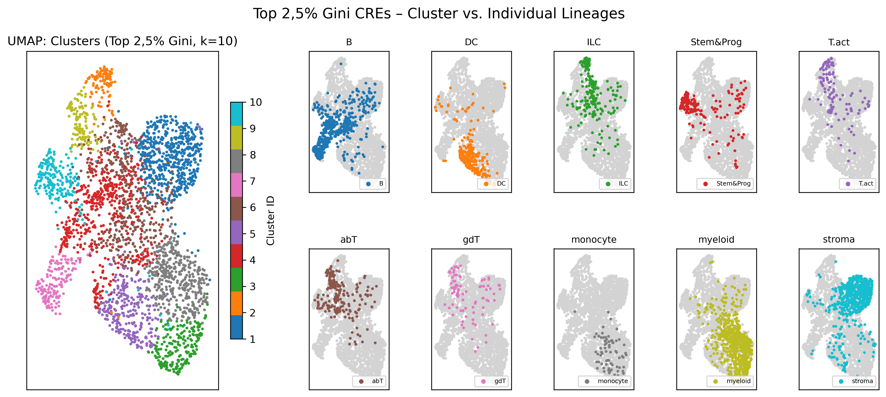
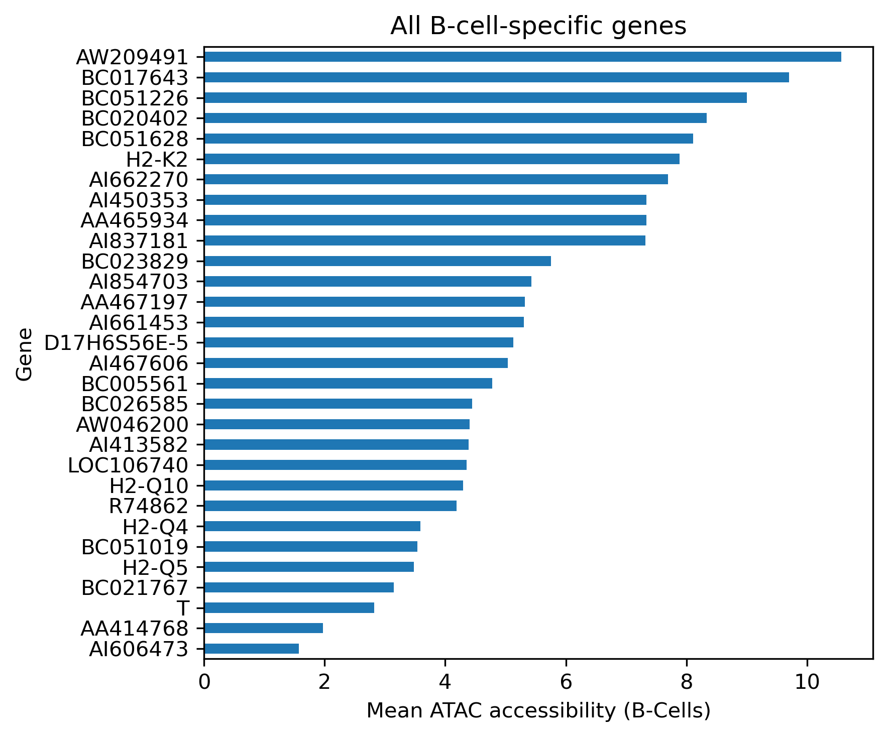
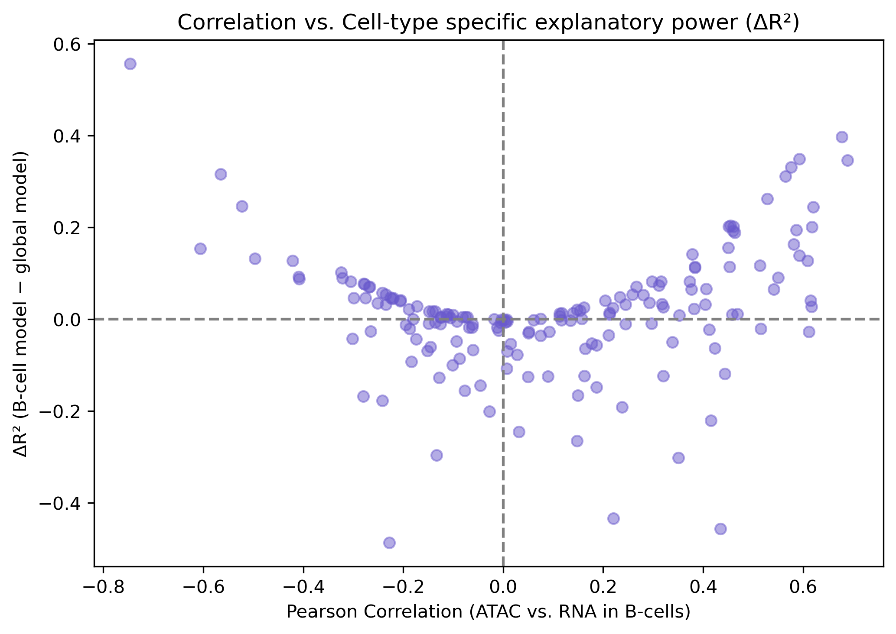
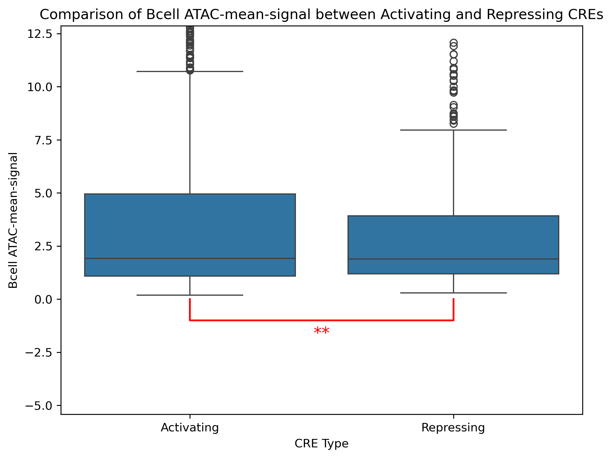
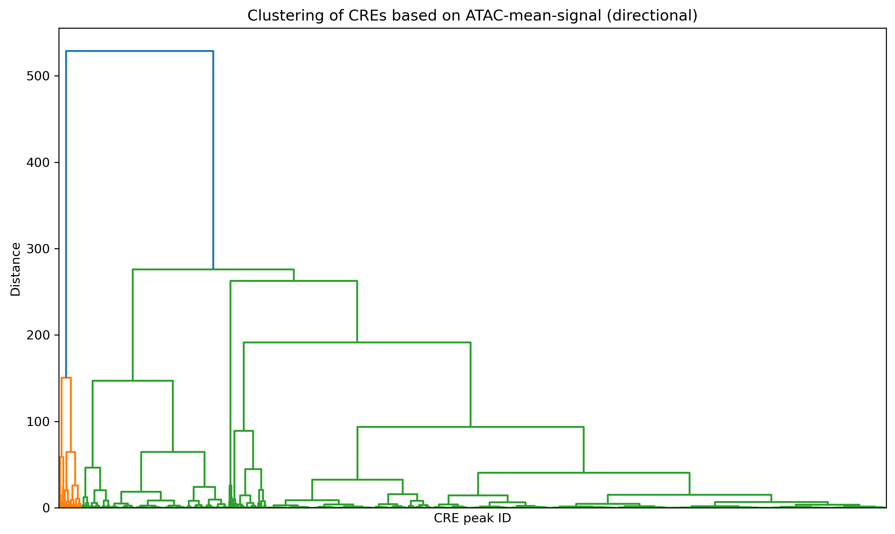
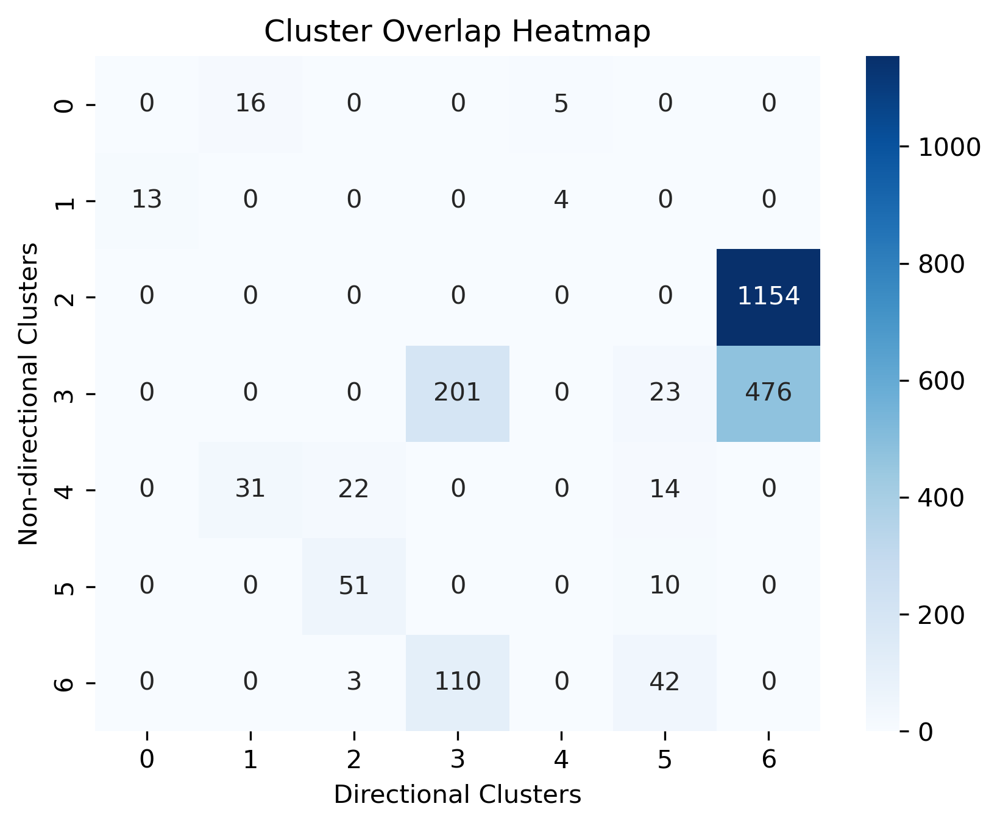

# Uncovering CREs of B-Cells

## Project overview
Differential gene expression and chromatin accessibility jointly define cell identity. By integrating ATAC-seq (chromatin accessibility) with RNA-seq (gene expression), we reconstruct cis-regulatory networks and quantify how promoters and enhancers drive transcription during immune differentiation.

B lymphocytes (B cells), key effectors of adaptive immunity, arise from hematopoietic stem cells in the bone marrow and traverse a well-defined developmental cascade: 
**pro-B → pre-B → immature/transitional B → naïve follicular B → germinal-center B → memory B → plasma cell**. 

Each stage is governed by a distinct constellation of transcription factors and epigenetic modifications, creating unique accessibility and expression signatures that underpin B-cell specification, activation, and long-term immunity.

## Data & Recources
The original RNA and ATAC data are in our '/data' folder
- 'mmc2.xlsx'
- 'ImmGenATAC18_AllORsInfo.csv'

The remaining original datasets can be found in this Heibox link: https://heibox.uni-heidelberg.de/d/8eb927e475024eb3ae66/

## Overview of our analytical workflow
- **Exploratory Data Analysis**: Correlation heatmaps, distribution plots, outlier detection
- **Dimensionality Reduction and Clustering**: using K-means and hierarchcal clustering of CREs and genes as well as t-SNE/PCA on ATAC and RNA matrices
- **Differentioal and Variance Components analysis**: determining promotor and enhancer regulation
- **Cis-regulatory Mapping**: correlating OCR accesibility with nearby gene expression
- **linear Regression**: lineage specific modeling

## Results:

## How variable is the chromatin signal within cells?

### Is the signal (median, mean, std) dependent on the sequencing depth, number of input cells, or another QC metric?

This heatmap shows the correlation between ATAC statistics and the QC-metric. The signal (mean) shows the strongest dependence with the Paired.read.after.removing.PCR.duplication. The std and var is highly dependend on the Replicate.cor. The other OC metrics show only weak correlations. 

Cell types were hierarchically clustered based on their genome-wide ATAC signal. The barplot shows normalized mean accessibility per cell type, colored by lineage. The accompanying dendrogram reflects epigenomic similarity and highlights both lineage-specific patterns and cross-lineage relationships in chromatin accessibility.

## How variable is the chromatin signal for CREs across cells?
### Should some peaks be removed for downstream analysis due to lack of signal?
The hexplots show no significant peaks that should be removed. 

### Do promoters exibit specific signals that make them differ from enhancers?

This plot shows how the mean ATAC-signal depends on the distance to the TSS. The red box shows the peaks that are labeled as promoters while the other ones are labeled as enhancers. The plot shows that promoters exhibit a higher ATAC-mean-signal than enhancers which means the chromatin in promoters is more open than in enhancers. 

A two-sample t-test comparing Promoter and Enhancer regions showed a highly significant difference in mean ATAC signal (T-statistic: 87.445, p-value: 0.000e+00). This result suggest a strong distinction between the ATAC mean signal of the two region types. 

### Is there a relationship between the signal and the distance to the TSS?

This scatterplot shows no significant linear relationship between ATAC signal and distance to the TSS, the Pearson correlation is r = −0.001, p = 0.561. But visible in the plot is a spike in ATAC signal near TSS (0 bp), which rapidly decreases with distance. So despite there being no global linear relationship, there is a strong local increase in ATAC signal near TSS, indicating biological relevance.

This local increase in ATAC signal near TSS can be seen in this plot. 

### Are intronic enhancers different from enhancers outside the transcript.

A two-sample t-test comparing intonic enhancers and non-intronic enhancers showed a highly significant difference in mean ATAC signal (T-statistic: -8.911, p-value: 5.087e-19). These values show a strong distinction between the ATAC mean signal of the two region types.

## Do related cell types cluster together based on their ATAC signal?

### Does the clustering reproduce known relationship between cells?

The UMAP on the left shows CREs colored by their KMeans cluster assignment, while the 10 UMAPs on the right display CREs associated with each of the 10 analyzed lineages.
KMeans clustering does accurately cluster the lineages. One can see that all T cell lineages UMAPS are in the same area capturing the relationships. All lineages are located in a different area of the UMAP. 

### Can one quantify the similarity of cell types in a sorted matrix?

**Principal Component Analysis: Lineage and Cluster Mapping**

PCA of chromatin accessibility data reveals some lineage-specific structure. Points are colored by cell lineage and shaped by k-means cluster assignment (k = 5). While Cluster 1 aligns strongly with B cells, overall separation between clusters is limited, indicating that chromatin signal alone does not fully resolve cell types.

This UMAP plot represents the landscape of open chromatin regions (OCRs) across all analyzed cell types. Each point corresponds to a single OCR, positioned based on its chromatin accessibility profile.
High Gini values indicate strong cell-type specificity, highlighting distinct regulatory elements active in individual lineages.

## Can one define different classes of peaks based on the signal and the signal variation across cells?

### Can one cluster CREs based on their ATAC-signal?

CREs can be clustered based on their ATAC signal. Clustering into 10 groups yields a clear structure, which supports our initial hypothesis, as we are analyzing 10 distinct lineages.

### Can one visualize the behaviour of clustered regions?

Here you can see the average ATAC signal for each cluster, aggregated across all cell types. The clusters clearly differ in their "Mean ATAC singal" ranges.

### Can one define B-cell specific CRE clusters?
As shown in the heatmap in the heatmap of iv. a), only cluster 6 is B cell-specific, as the mean accessibility is high exclusively in B cells.

### When and how long is the B-cell specific cluster active?
B-cell specific cluster 6 becomes accessible already in s
Stem and Progenitor cells, indicating that its activation begins early during hematopoiesis. It remains accessible throughout B-cell differentiation, suggesting a long-lasting regulatory role. This sustained activity implies that cluster 6 may be involved in establishing and maintaining B-cell identity over an extended developmental window.

## Does clustering of the gene expression matrix show the same relationships between cell types as the ATAC-seq data?

Our initial hypothesis was that clustering based on chromatin accessibility (ATAC-seq) and gene expression (RNA-seq) would reveal similar lineage relationships. Specifically, we expected that the major cell lineages would each form distinct and matching clusters in both datasets. We anticipated 10 RNA-seq clusters and 10 ATAC-seq clusters, each reflecting similar regulatory programs.
However, the hierarchical clustering dendrograms do not support this clean one-to-one relationship. Clusters were labeled by assigning them the lineage most proportionally represented within them, since some lineages are assigned to more than one cluster. Looking at the cluster labels, you can see that some lineages appear more than once and some don't appear at all. 
To quantitatively assess the similarity between the two clusterings, we used three metrics:

- Adjusted Rand Index (ARI): 0,680
- Fowlkes-Mallows Index (FMI): 0,726
- Cophenetic distance correlation: r = 0,073, p = 0.0000

While the ARI and FMI suggest moderate agreement, the very low cophenetic distance correlation indicates that the global structure of the dendrograms is poorly conserved between RNA and ATAC. 
This interpretation is supported by the cluster overlap heatmap, which displays mostly zero values with a few clearly enriched entries, reflecting specific and biologically meaningful overlaps between certain RNA- and ATAC-based clusters. This suggests that although the overall clustering structures differ, there is still targeted consistency in how some cell types are grouped across the two modalities. Moreover, RNA-seq clustering resulted in 11 clusters, while ATAC-seq produced only 9, further highlighting the deviation from our expectations.
 
## Can one use correlation analysis and distance information to associate ATAC-seq regions with gene expression?

### Where are associated CREs located with respect to the TSS?

This Histogram visualizes the distance of associated CREs with the corresponding TSS. 

### Where are the most associated CREs located?

Here we annotated the B-cell peaks by priority (promoter (±1 kb), exon, intron, intergenic) using pyranges to report the relative frequencies. Most CREs are located in intron (41.8%) and intergenetic regions (40.1%).   

### How many CREs are associated with genes?

Detection of gene association by checking whether the B cell peaks have ≥1 gene within 100 kb (60.3 %) or none (orphan CREs, 39.7%).

### Is every promoter associated with a gene?
63 of 32241 Promotors are not associated with a gene, see also figure 'figures/Distribution of gene‐counts per promoter'

### Are some promoters associated with other genes?

This Histogram depicts the promotor gene overlap distribution.Most promoters overlap exactly one gene, with progressively fewer overlapping two or more.

### Are there CREs that control several genes?

Having confirmed that promoters almost invariably overlap exactly one gene (with only a small tail reaching multiple targets; see 'figures/Distribution of gene-counts per promoter'), we next tallied the number of genes associated with enhancers. The resulting enhancer-gene count distribution is strikingly broader: whereas most enhancer still influence only 1 gene, a large fraction of enhancers have no nearby gene at all, and a clear  peak appears at two gene associations—highlighting the more diverse regulatory reach of enhancers compared to promoters.
## Can one use regression to associate CREs with gene expression?
### How much of the variance of gene expression can be explained for each gene with this approach?

This shows how well the ATAC signal explains the RNA signal for all celltypes. For most genes (R² ≈ 0) the  ATAC data explains almost none of their expression levels across cell types. But for the genes with a higher R², the chromatin accessibility seems to have a stronger predictive value.

### How do the coefficients differ when it is performed on B-cells alone?

This shows how well the ATAC signal explains the RNA signal only for the B-Cells. When regression is performed on B-Cells alone, more coefficients are higher. This indicates, that for B-Cell-specific regression, the chromatin accessibility has a stronger predictive value than for regression over all celltypes. 

This result can also be seen in this scatter plot. The mean ΔR² (B-cell - all celtype) of 0.0453 indicates that the chromatin accessibility in B-cells explains gene expression better than the global model across all cell types. This suggests that the gene regulation via chromatin structure is (partly) B-cell-specific and that there are lineage-restricted regulatory mechanisms.

### Which CREs control B-cell genes?

This plot shows the ATAC-signal of the genes that have a high ΔR² which means the chromatin accesibility explains the gen expression in B-Cells better than across all celltypes. These genes were labeled as B-Cell-specific genes. 

The ΔR²-values of these B-Cell-specific genes can be seen in this plot.

To determine the CREs that control B-Cell-specific genes the peaks associated with these B-Cell-specific genes were identified. The 1845 B-Cell-specific genes can be seen in the dataframe: CREs_for_BCell_specific_genes

### How do the results of this analysis differ from pure association via correlation?

This plot shows the relationship between the R²-values and the correlation. The correlation only measures if there is a relationship between ATAC-signal and RNA-signal, not the direction. R² reflects how well a linear model explains gene expression from accessibility. The plot shows that genes with low correlation (low relationship in general) also have low R²-values (chromatin-accesibility does not explain genexpression well). If the correlation is higher (negative or positive) the R²-values are higher, which means that if there is a stronger relationship in general between ATAC-signal and RNA-signal, the chromatin-accesibility (ATAC-signal) explains the genexpression (RNA-signal) better. 
So this plot shows that the results of the analysis via regression and via correlation do not differ. The regression just gives even more information (about the diretion) than the correlation.

This plot also consideres the cell-type-specific effects by showing the relationship between the ΔR²-values and the correlation. Again it shows that the results of the analysis via regression and via correlation do not differ.

### Are there differences between activating and repressing CREs?

This boxplot shows the R² of activating and repressing CREs in B-Cells. A two-sample t-test showed no statistically significant difference between the two groups (T-statistic: 0.335, p-value: 7.390e-01). This means that for neither activating or repressing CREs the chromatin-accesibility explains the genexpression more than for the other group.

This plot compares the ATAC-mean-signals od repression and activating CREs. A two-sample t-test revealed a statistically significant difference between the two groups (T-statistic: 2.295, p-value: 2.184e-02), indicating a strong difference in their means. It indicates that for activating CREs the chromatin-accesibility is lower than for repressing CREs. 

This plot also shows the ATAC-mean-signal for activating and repressing CREs. It shows the same results, that the chromatin-accesibility for repressing CREs is higher than for activating CREs. 

### How many genes are mainly regulated by a repressing CREs, and can promoters act through repression?

This plot shows how many genes are mainly regulated by repressing CREs and which by activating CREs. 

### Can promoters act through repression?

This plot shows that promoters mainly act activating but still can act through repression (small part).

### Where are repressing CREs located compared to activating CREs?

This plots shows the location of repressing and activating CREs on the different chromosomes. It shows now significant trend although it indicates that on chromosome 1, 2, 7, 8, 10, 13, 19 and X there are only activating CREs, while an chromosome 5 and 6 there are only repressing CREs. 

The KDE plot considers the location of repressing and activating CREs regarding the distance to the TSS. It shows that activating CREs are a bit closer to the TSS than repressing CREs.

### Are there CREs that are repressing for one gene but activating for another gene?

This heatmap shows Cres that are both activating (red) for one gene but repressing (blue) for another gene. 

This is a picture of an interactive network that can be looked at in the notebook (RNA_seq.ipynb). The network shows the connection of the CREs and the associated genes (green lines indicate an activating relationship and red lines a repressing).

### Does CRE clustering change if one includes the effect direction on gene expression?

This plot shows that there is a moderate to good similarity between the two clusterings. The same result is obtained by the Adjusted Rand Index with a value of 0.434.

## Can one cluster genes based on their expression profiles?

Clustering genes based on their expression levels using KMeans does not yield meaningful results. There are no clearly defined lineages within the clusters — genes are either expressed across all lineages or not at all. Expression patterns remain nearly identical between lineages within each cluster.

### Can your determine a specific set of genes for B-cells?

We already generated a list of genes with high chromatin accessibility in B cells, which we labeled as B cell–specific genes. These were identified based on a high ΔR², indicating that chromatin accessibility explains gene expression more strongly in B cells than across all cell types.

### Are there subclusters of special interest?

Clustering of B cell–specific genes reveals three distinct groups with clearly different ATAC accessibility across cell types. As a result, the clusters are well separable based on their mean accessibility profiles. Cluster 1 contains the genes with the highest mean ATAC accessibility and shows complete overlap with the top B cell–specific genes identified based on high ΔR² values. This indicates that genes with high chromatin accessibility across cell types are exactly those most strongly associated with B cell–specific regulation.

## Team 
Group 1 (B cells): Liska Großmann, Celine Krogmann, Annalena Kotz, Lilli Schmitt

Supervisor: Dr. Alexander Sasse

Tutor: Aidana Smugalova