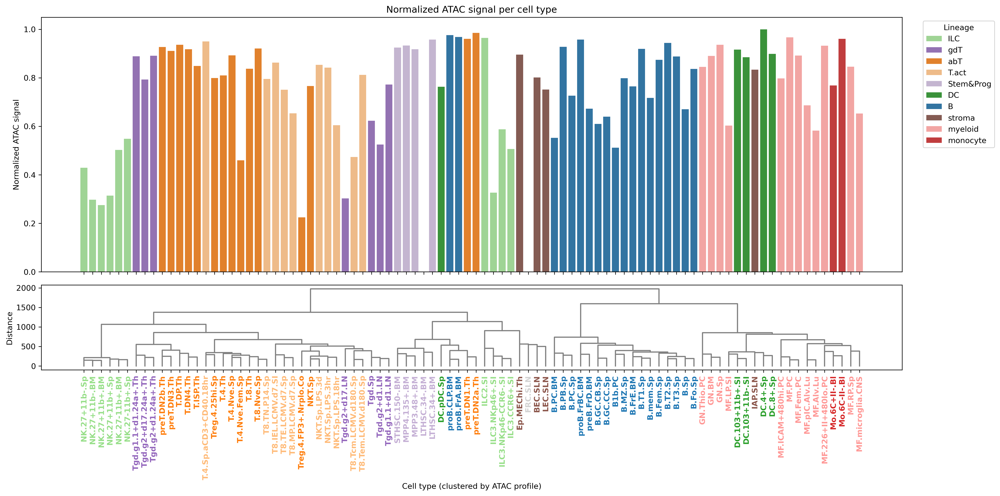
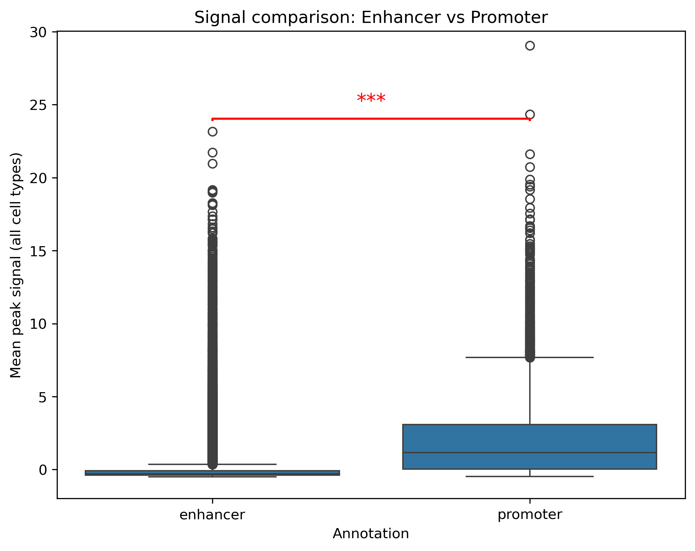
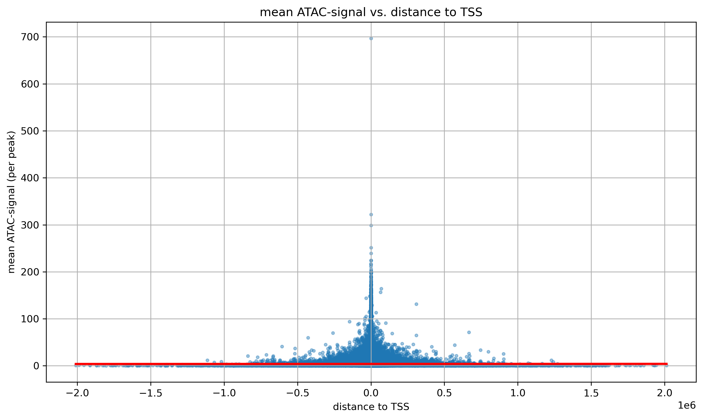
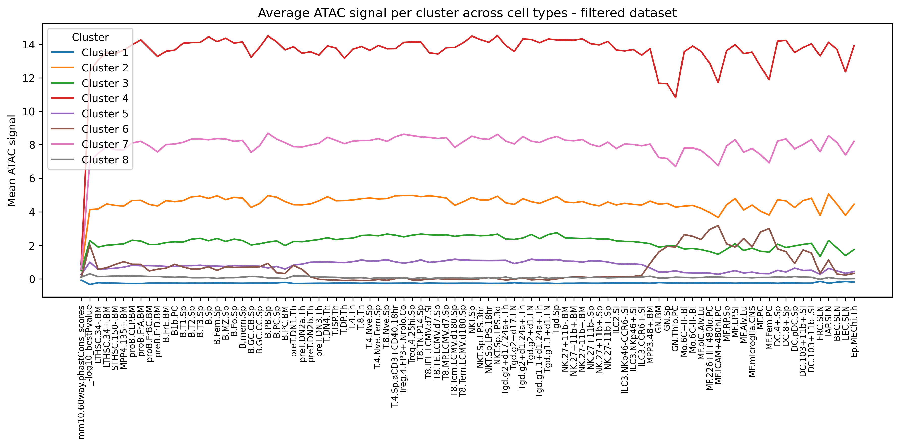
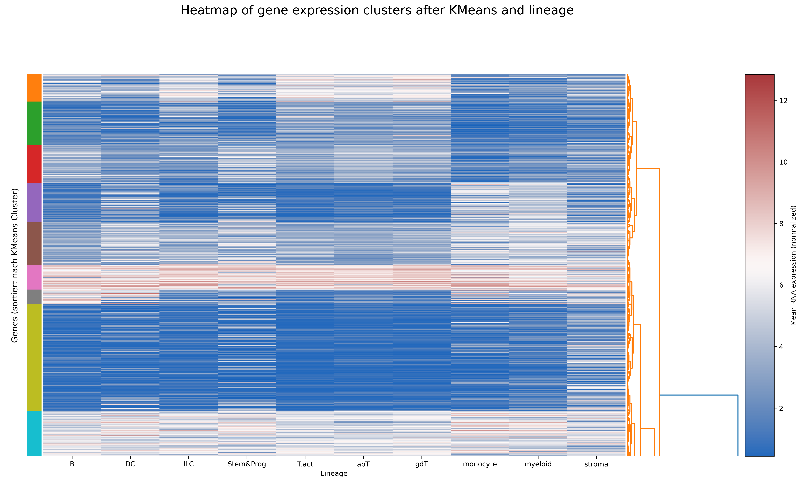
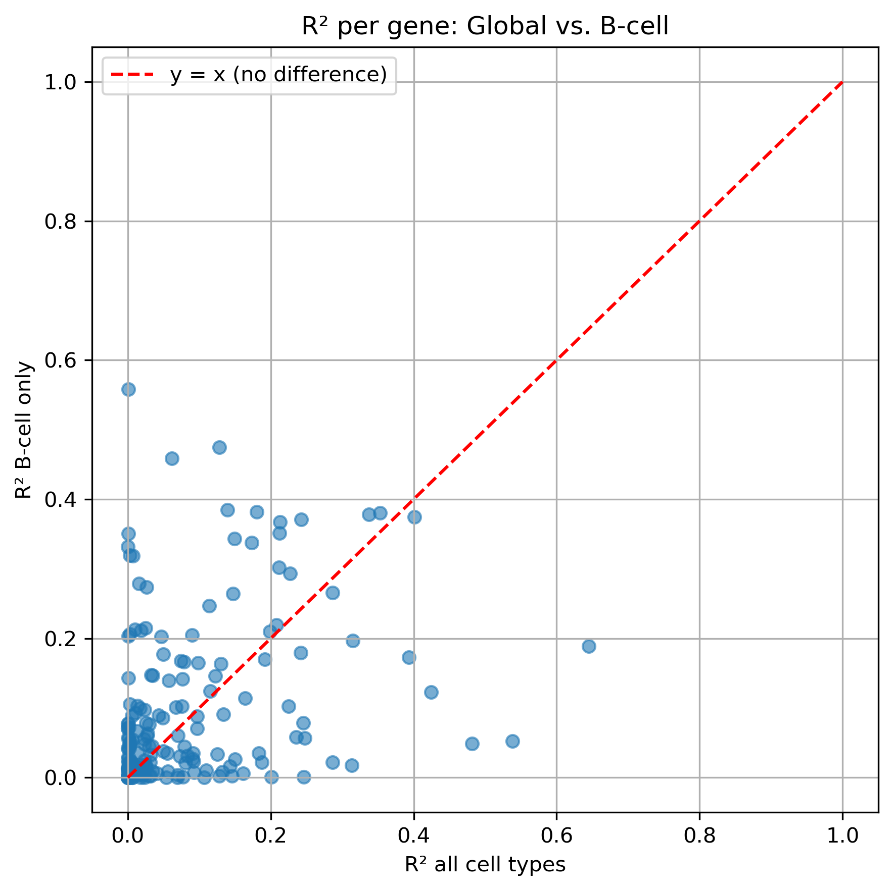
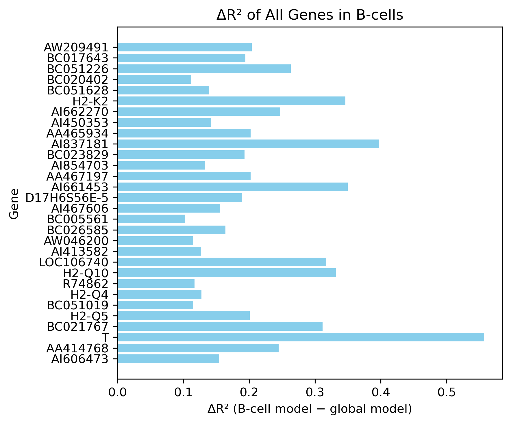
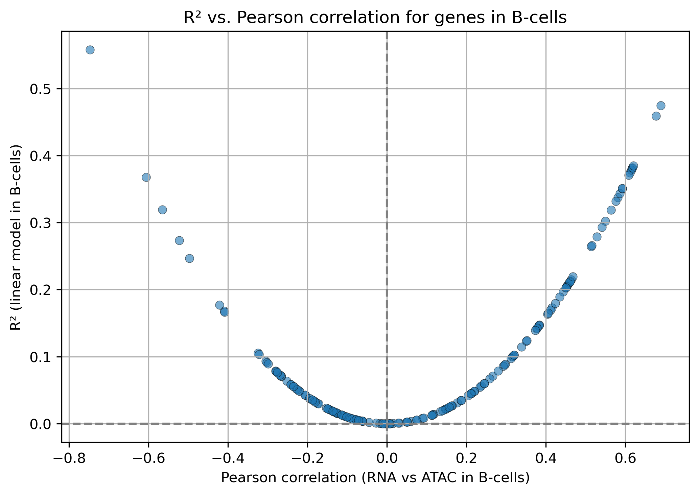

# B-cells-Team1

Heibox with tables converted to csv-format: 

https://heibox.uni-heidelberg.de/d/8eb927e475024eb3ae66/

To implement the collective virtual environment: 

cd *project directory*\
conda env create -f environment.yml\
conda activate envBCells1

## 1. i

### a. ATAC QC vs stats

### mean ATAC peaks colored by lineage

### mean ATAC peaks colored by lineage with dendrogramm 

-> remove first cell ??

## 1. ii

### a. remove peaks due to low signal 

### b. Signals of promotors and enhancers

### c. correlation of peak and distance to TSS

### d. intronic vs. non intronic enhancer

### Distribution of mean ATAC peaks

### OCR landscape - UMAP

## 1. iii

### PCA

## 1. iv

### Cre cluster activity per lineage

### Visualization of clustered regions

### Define cell lineage-specific CRE clusters

B-lineage-specific clusters with mean log2FC > 0.85: [4, 8, 9]

### Relative activity per cluster by row-normalizing (z-scoring) the data

->Colors indicate whether the lineage is more or less active relative to that cluster’s average
->Are there differences between these cell-lineage specific CRE clusters? When and how long are they active?  Wir das so beantwortet???

### Tried to cluster CREs based on Gini-index 

### CRE-Cluster across lineages based on top 20% Gini-number

->does not make sense since i used Gini-index??

### Tried to link CRE-clusters and lineage based on Gini-index 

## 2. i

### RNA vs ATAC

## 2. ii
### Mean gene expression per cluster across lineages 

### Distribution of gene expression in gene clusters across lineages

### Mean gene expression per cluster across lineages

### Distribution of gene expression in gene subclusters across lineages

## 2. iv
### a. regression for all celltypes 

### b. regression for B-Cells

### c. cell-lineage specific CREs

### d. how do the results of R^2 and correlation differ

### e. difference of activating and repressing CREs

