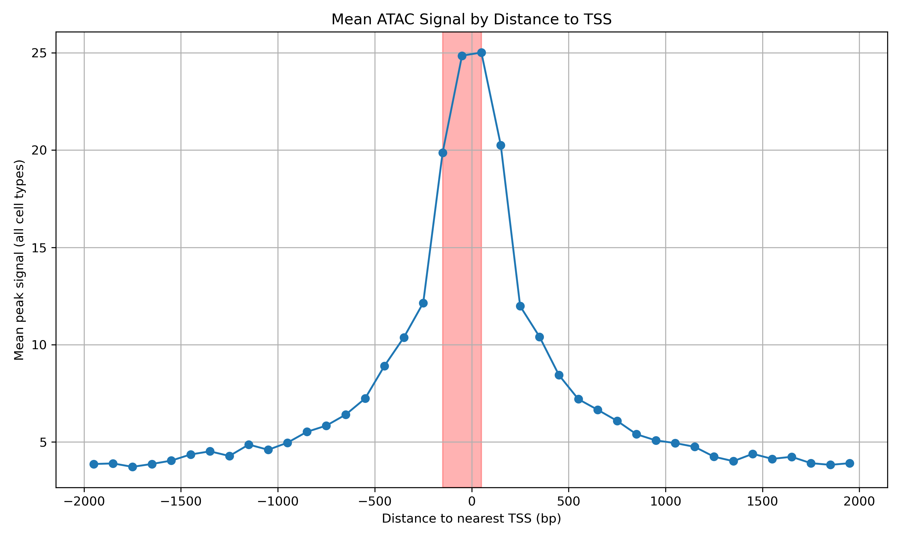
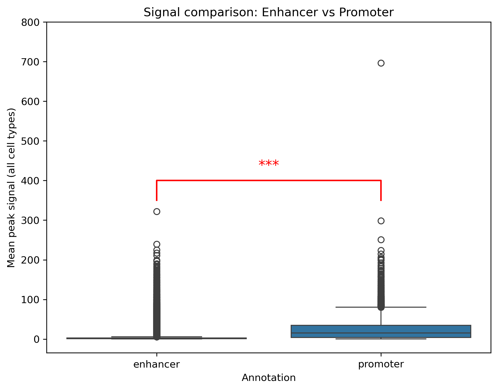
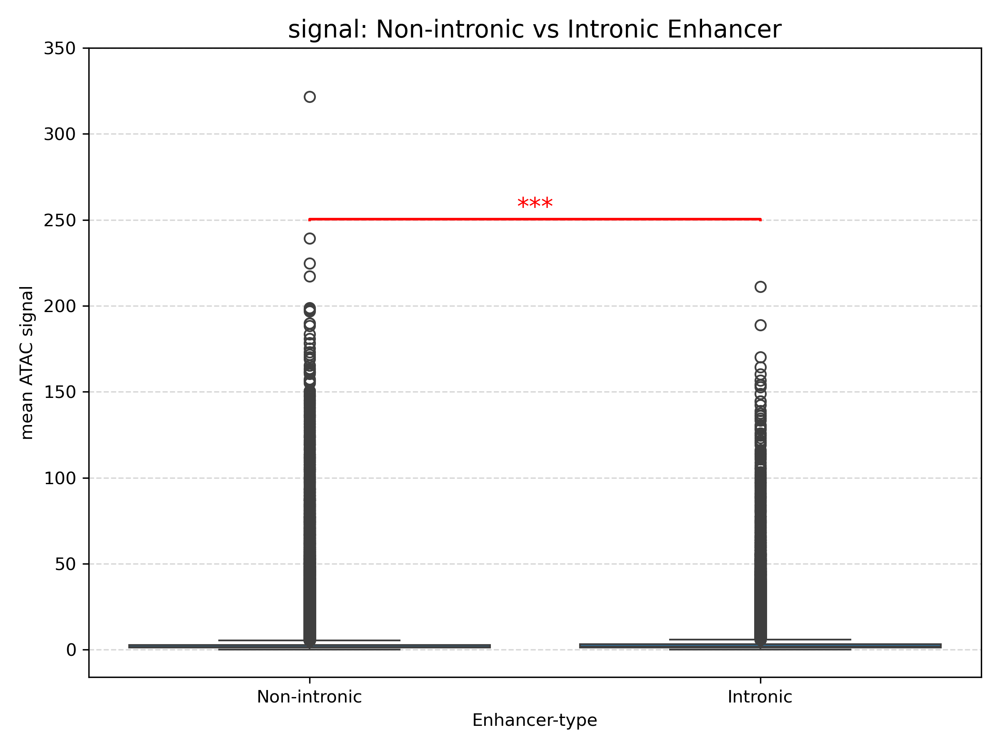
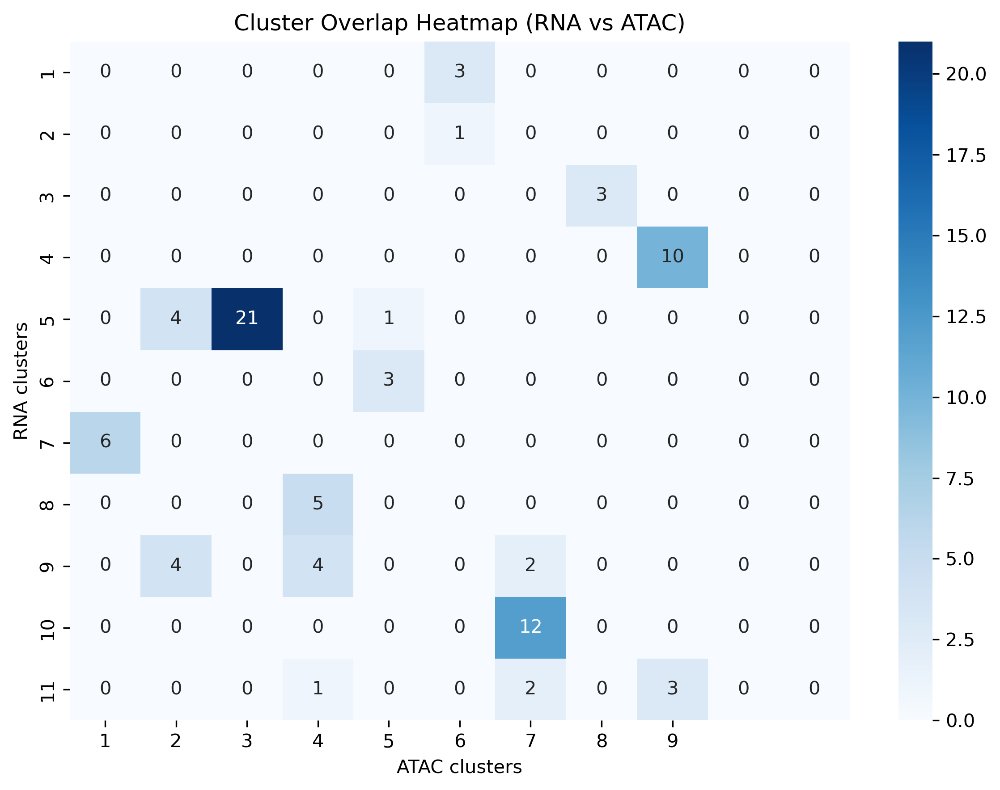
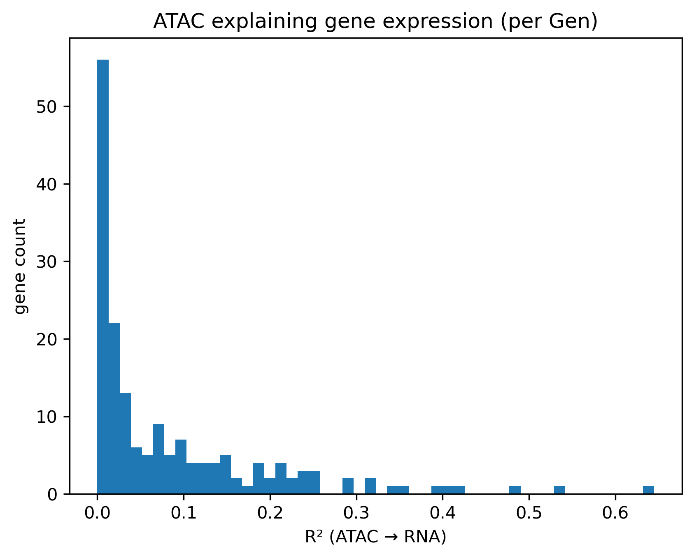
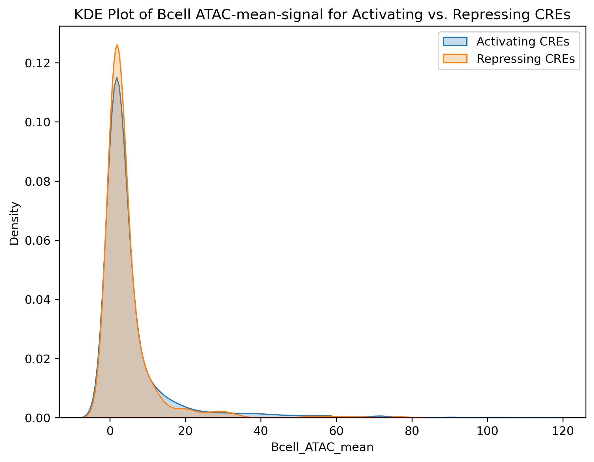
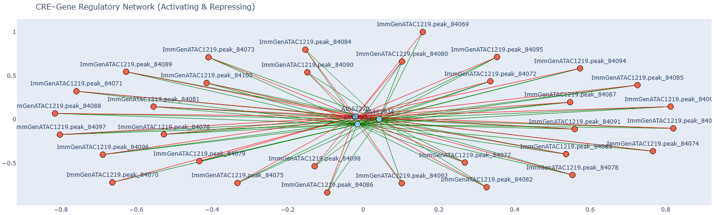
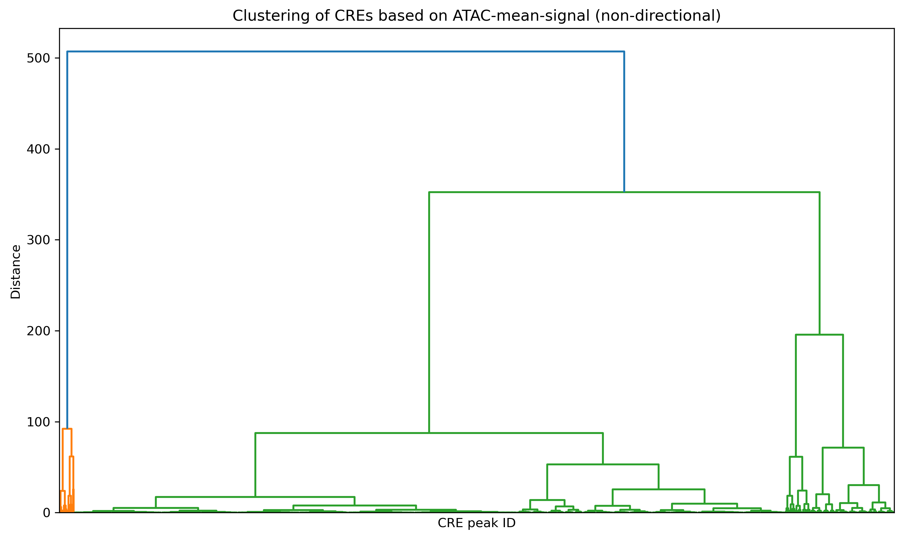

# B-cells-Team-1

Heibox with tables converted to csv-format: 

https://heibox.uni-heidelberg.de/d/8eb927e475024eb3ae66/

To implement the collective virtual environment: 

cd *project directory*\
conda env create -f environment.yml\
conda activate envBCells1

## How variable is the chromatin signal within cells?

### Is the signal (median, mean, std) dependent on the sequencing depth, number of input cells, or another QC metric?

This heatmap shows the correlation between ATAC statistics and the QC-metric. The signal shows the strongest dependence on InputCellNumber, with correlation coefficients of 0.67 (mean), 0.6 (std), and 0.47 (median). The other OC metrics show only weak correlations. This means that signal strength is most strongly associated with the number of input cells. 

### Should some cell types be removed from downstream analysis, or should we apply additional normalization?

- dendrogramm?

## How variable is the chromatin signal for CREs across cells?
### Should some peaks be removed for downstream analysis due to lack of signal?

Different Hexbin Plots were used to determine peaks that should be removed (peaks with low mean, std, var). The red box shows the peaks that were removed our of the data set due to lack of signal. 

### Do promoters exibit specific signals that make them differ from enhancers?

This plot shows how the mean ATAC-signal depends on the distance to the TSS. The red box shows the peaks that are are labeles as promoters while the other ones are labeled as enhancers. The plot shows that promoters exhibit a lower ATAC-mean-signal than enhancers which means the chromatin in promoters is more closed than in enhancers. 

A two-sample t-test comparing Promoter and Enhancer regions showed a highly significant difference in mean ATAC signal (T = –34.13, p = 1.05 × 10⁻²³⁹). This result suggest a strong distinction between the ATAC mean signal of the two region types. 

### Is there a relationship between the signal and the distance to the TSS?

The Pearson correlation analysis gave the values: r = -0.004, p = 9.23e-03

### Are intronic enhancers different from enhancers outside the transcript.

A two-sample t-test comparing Promoter and Enhancer regions showed a highly significant difference in mean ATAC signal (T = T-statistic: 69.853, p = 0.000e+00). These values show a strong distinction between the ATAC mean signal of the two region types.

## Do related cell types cluster together based on their ATAC signal?

### Does the clustering reproduce known relationship between cells?

- Dendrogramm um Verwandheit zu zeigen

### Can one quantify the similarity of cell types in a sorted matrix?

-> outlier wegschmeißen

## Can one define different classes of peaks based on the signal and the signal variation across cells?

### Can one cluster CREs based on their ATAC-signal?

CREs can be clustered based on their ATAC signal. Clustering into 10 groups yields a clear structure, which supports our initial hypothesis, as we are analyzing 10 distinct lineages.

### Can one visualize the behaviour of clustered regions?

Here you can see the average ATAC signal for each cluster, aggregated across all cell types. The clusters clearly differ in their "Mean ATAC singal" ranges.

### Can one define B-cell specific CRE clusters?
As shown in the heatmap in the heatmap of iv. a), only cluster 6 is B cell-specific, as the mean accessibility is high exclusively in B cells. Cluster 9 does not show lineage specificity but B cells, gdT cells, and myeloid cells all exhibit similarly high mean accessibility.

### Are there differences between the B-cell CRE clusters? When and how long are they active?
The UMAP of iii. a) shows that cluster 6 is overlapping in B-cells and Stem&Prog-cells. HELP wie soll man das formulieren?

## Does clustering of the gene expression matrix show the same relationships between cell types as the ATAC-seq data?

- Cluster nach lineage anfärben
Gene mit weniger Varianz rauskicken, 10 mit weniger Variabilität score rausnehmen

Adjusted Rand Index: 0.534
Fowlkes-Mallows Index: 0.592
Cophenetic distance correlation: r = 0.090, p = 0.0000

## Can one cluster genes based on their expression profiles?

Clustering genes based on their expression levels using KMeans does not yield meaningful results. There are no clearly defined lineages within the clusters — genes are either expressed across all lineages or not at all. Expression patterns remain nearly identical between lineages within each cluster.

### Can your determine a specific set of genes for B-cells?

### Are there subclusters of special interest?

Cluster 1 mit höchster mean accessibility entsprichte den Top B-cell-specific genes:

 
## Can one use correlation analysis and distance information to associate ATAC-seq regions with gene expression?

### Where are associated CREs located with respect to the TSS?

### Where are the most associated CREs located?
### How many CREs are associated with genes?
### Is every promoter associated with a gene?
### Are some promoters associated with other genes?
### What is the closest associated CRE to a gene?
### Are there CREs that control several genes?

## Can one use regression to associate CREs with gene expression?
### How much of the variance of gene expression can be explained for each gene with this approach?

### How do the coefficients differ when it is performed on B-cells alone?

### Which CREs control B-cell genes?

### How do the results of this analysis differ from pure association via correlation?

### Are there differences between activating and repressing CREs?

### How many genes are mainly regulated by a repressing CREs, and can promoters act through repression?

### Can promoters act through repression?

### Where are repressing CREs located compared to activating CREs?

### Are there CREs that are repressing for one gene but activating for another gene?

[interactive Network: CREs that are both activating and repressing](figures/CRE-Gene-Regulatory-Network-Activating-Repressing.html)

### Does CRE clustering change if one includes the effect direction on gene expression?

