# B-cells-Team-1

Heibox with tables converted to csv-format: 

https://heibox.uni-heidelberg.de/d/8eb927e475024eb3ae66/

To implement the collective virtual environment: 

cd *project directory*\
conda env create -f environment.yml\
conda activate envBCells1

## How variable is the chromatin signal within cells?

### Is the signal (median, mean, std) dependent on the sequencing depth, number of input cells, or another QC metric?

### Should some cell types be removed from downstream analysis, or should we apply additional normalization?

## How variable is the chromatin signal for CREs across cells?
### Should some peaks be removed for downstream analysis due to lack of signal?

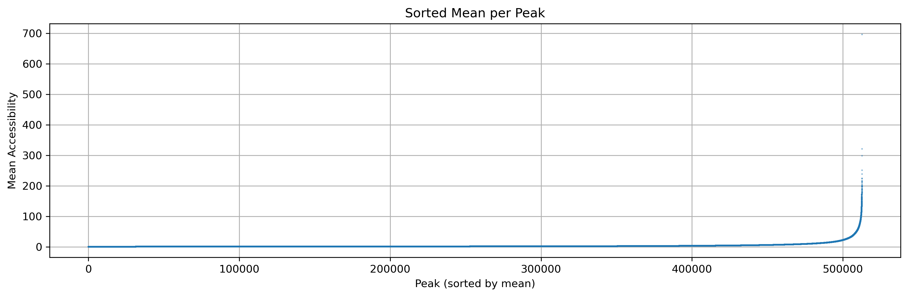
### Do promoters exibit specific signals that make them differ from enhancers?

### Is there a relationship between the signal and the distance to the TSS?

### Are intronic enhancers different from enhancers outside the transcript.

## Do related cell types cluster together based on their ATAC signal?

### Does the clustering reproduce known relationship between cells?

### Can one quantify the similarity of cell types in a sorted matrix?

## Can one define different classes of peaks based on the signal and the signal variation across cells?

### Cre cluster activity per lineage

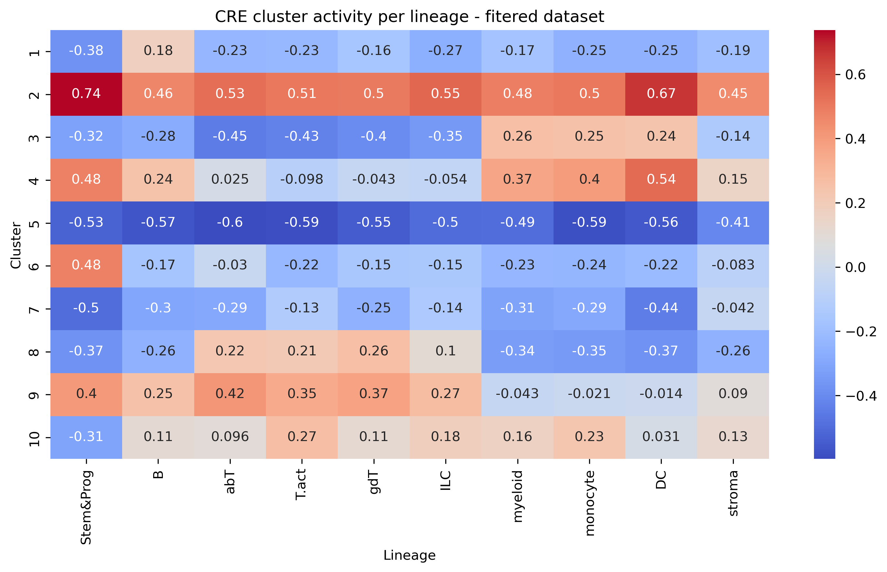

### Can one cluster CREs based on their ATAC-signal?

-> hat nur 20% top peaks über Gini index ist es besser als andere Heatmap?

### Can one visualize the behaviour of clustered regions?

### Can one define B-cell specific CRE clusters?

B-lineage-specific clusters with mean log2FC > 0.85: [4, 8, 9]

### ODER

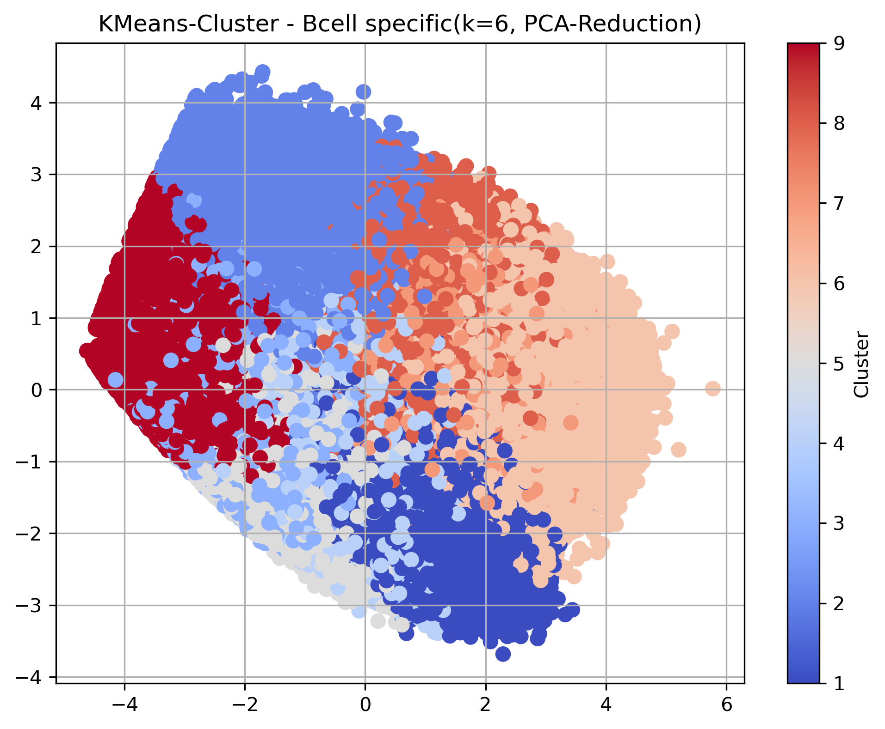

### Are there differences between the B-cell CRE clusters? When and how long are they active?

->Colors indicate whether the lineage is more or less active relative to that cluster’s average
->Wir das so beantwortet???

### ODER

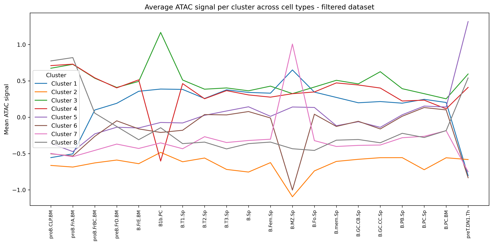
->ATAC-signal means ist verschieden

## Does clustering of the gene expression matrix show the same relationships between cell types as the ATAC-seq data?
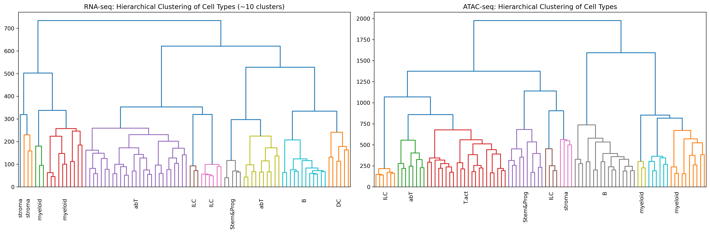

Adjusted Rand Index: 0.534
Fowlkes-Mallows Index: 0.592
Cophenetic distance correlation: r = 0.090, p = 0.0000

## Can one cluster genes based on their expression profiles?

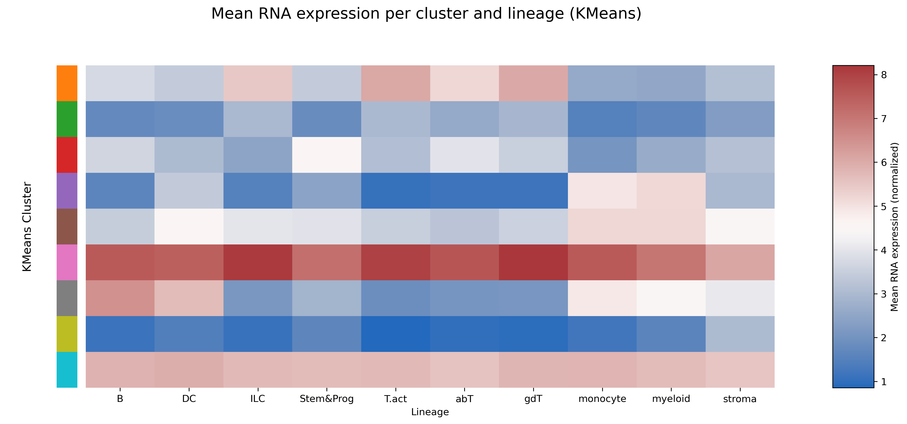

->welches der beiden ist besser??

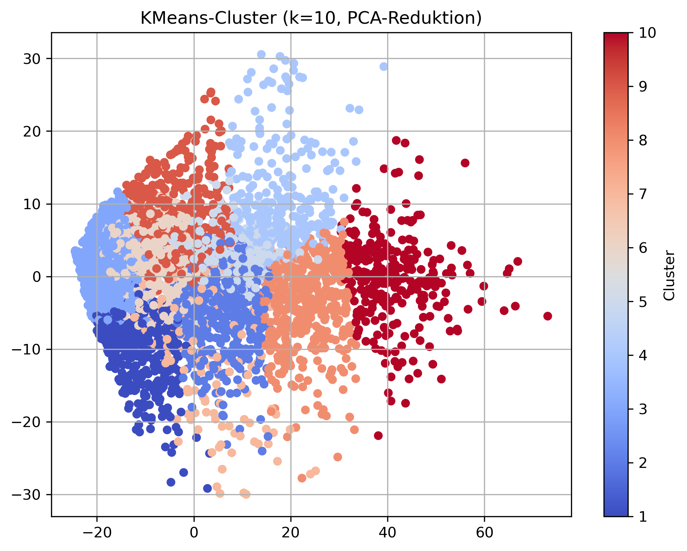
-> Clustered genes based on their expression level over the cell types

### Can your determine a specific set of genes for B-cells?

### Are there subclusters of special interest?

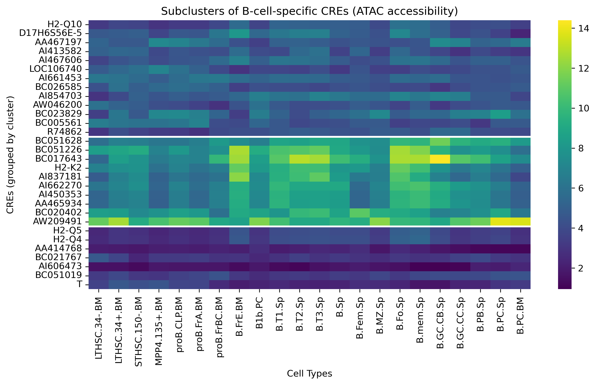

Cluster 1 mit höchster mean accessibility entsprichte den Top B-cell-specific genes:

 
## Can one use correlation analysis and distance information to associate ATAC-seq regions with gene expression?

### Where are associated CREs located with respect to the TSS?

### Where are the most associated CREs located?
### How many CREs are associated with genes?
### Is every promoter associated with a gene?
### Are some promoters associated with other genes?
### What is the closest associated CRE to a gene?
### Are there CREs that control several genes?

## Can one use regression to associate CREs with gene expression?
### How much of the variance of gene expression can be explained for each gene with this approach?

### How do the coefficients differ when it is performed on B-cells alone?

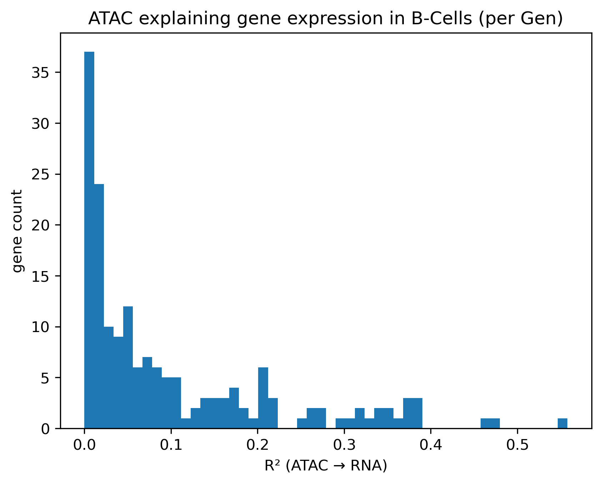

### Which CREs control B-cell genes?

### How do the results of this analysis differ from pure association via correlation?

### Are there differences between activating and repressing CREs?

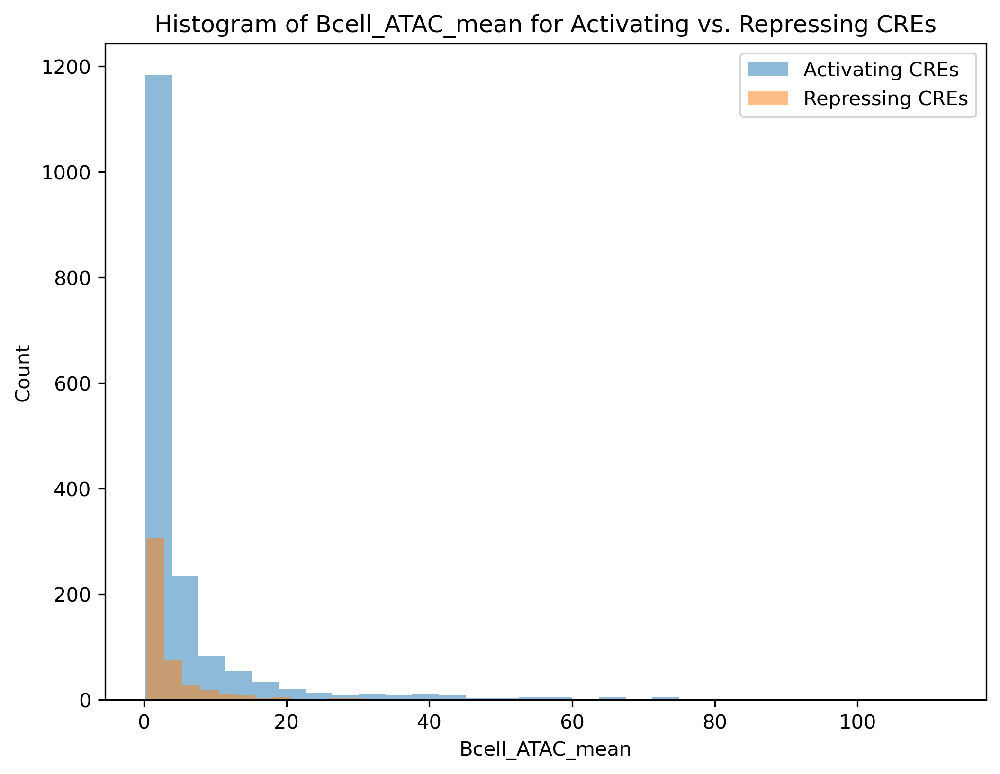

### How many genes are mainly regulated by a repressing CREs, and can promoters act through repression?

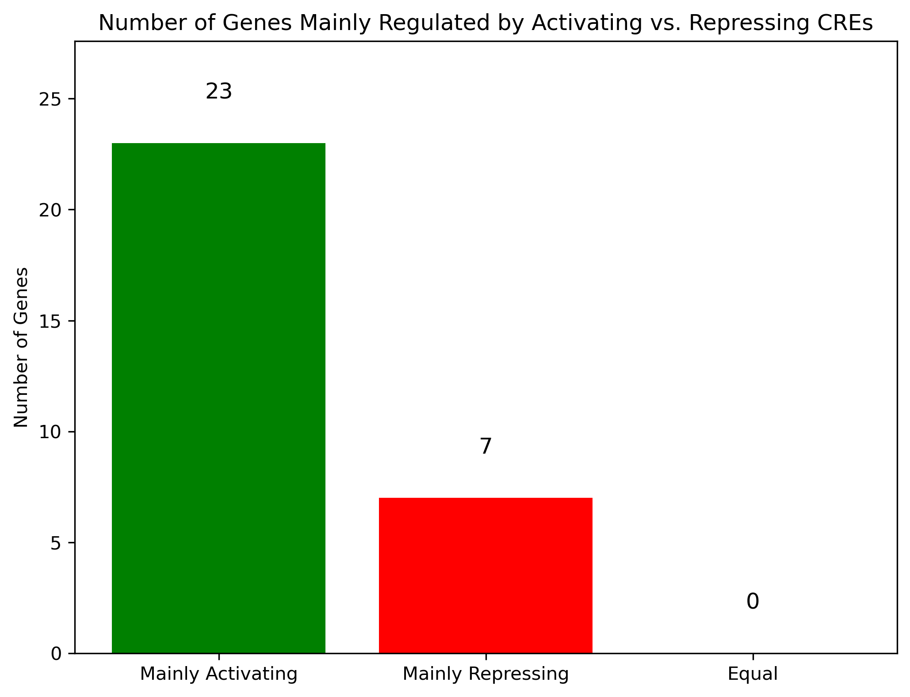

### Can promoters act through repression?

### Where are repressing CREs located compared to activating CREs?

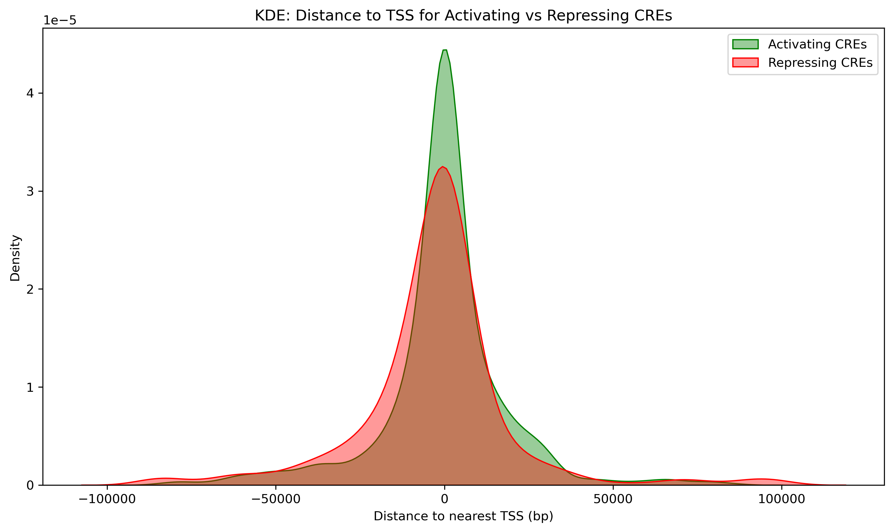

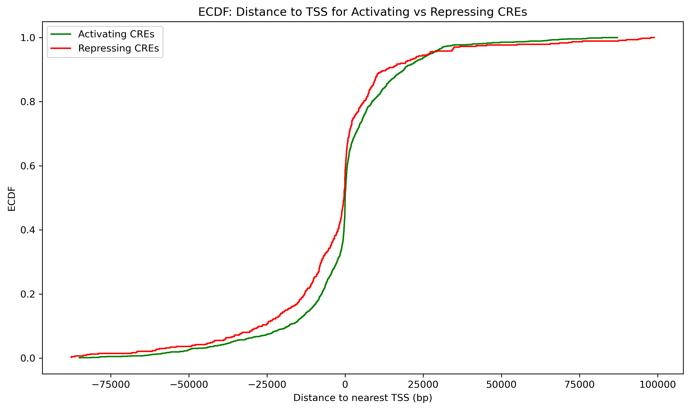

### Are there CREs that are repressing for one gene but activating for another gene?

[interactive Network: CREs that are both activating and repressing](figures/CRE-Gene-Regulatory-Network-Activating-Repressing.html)

### Does CRE clustering change if one includes the effect direction on gene expression?

-------------------------------------------------------------

### a. ATAC QC vs stats

### mean ATAC peaks colored by lineage

### mean ATAC peaks colored by lineage with dendrogramm 

## 1. ii

### a. remove peaks due to low signal 

### b. Signals of promotors and enhancers

### c. correlation of peak and distance to TSS

### d. intronic vs. non intronic enhancer

### Distribution of mean ATAC peaks

### OCR landscape - UMAP

## 1. iii

### PCA

## 1. iv

### Cre cluster activity per lineage

### Visualization of clustered regions

### Define cell lineage-specific CRE clusters

B-lineage-specific clusters with mean log2FC > 0.85: [4, 8, 9]

### Relative activity per cluster by row-normalizing (z-scoring) the data

->Colors indicate whether the lineage is more or less active relative to that cluster’s average
->Are there differences between these cell-lineage specific CRE clusters? When and how long are they active?  Wir das so beantwortet???

### Tried to cluster CREs based on Gini-index 

### Comparison of clustered CREs and lineages

### Tried to link CRE-clusters and lineage based on Gini-index 

BUT es macht keinen sinn weil wir ja die UMAP anhand der CREs gemacht haben und nicht anhand der lineages deswegen kann man es nicht vergleichen !

### CRE-Cluster across lineages based on top 20% Gini-number

## 2. i

### RNA vs ATAC

## 2. ii
### Mean gene expression per cluster across lineages 

### Distribution of gene expression in gene clusters across lineages

### Mean gene expression per cluster across lineages

### Distribution of gene expression in gene subclusters across lineages

## 2. iv
### a. regression for all celltypes 

### b. regression for B-Cells

### c. cell-lineage specific CREs

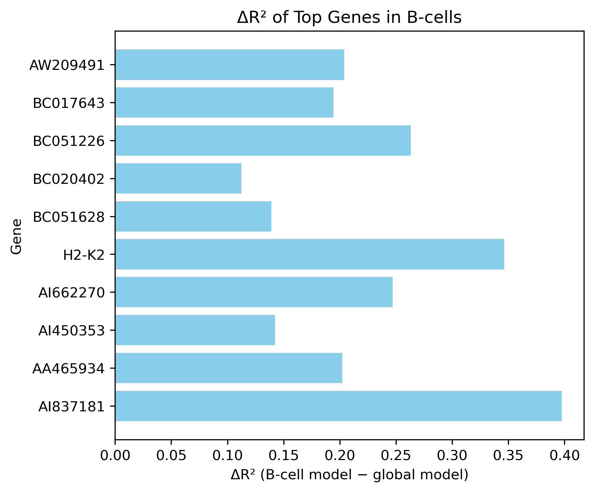

### d. how do the results of R^2 and correlation differ

### e. difference of activating and repressing CREs

### f. How many genes are mainly regulated by repressing CREs

### f. Can promotors act through repression 

### g. Where are repressing CREs located compared to activating CREs?

